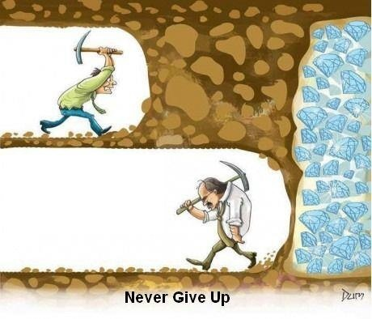

# Giới thiệu

Trong một thế giới tương lai được thống trị bởi tiền điện tử và các công nghệ phi tập trung, một cách kiếm tiền mới nổi lên được gọi là: "Săn Airdrop". Nó là cách thức khai phá những kho báu ẩn giấu dưới hình thức các airdrop, những token miễn phí (free token), được phân phối bởi các dự án blockchain để mở rộng cộng đồng. Không nằm gói gọn trong việc Săn Airdop, cuốn sách này còn về cách mua bán crypto theo chu kì để có thể đạt được lợi nhuận tốt. Hy vọng nó giúp các newbies - người mới vào thị trường tránh được sự đu đỉnh và sợ bỏ lỡ cơ hội (FOMO) trong crypto.

Do đó cuốn sách này sẽ chia sẻ hai chủ đề chính:

1. Kiếm tiền online bằng cách săn tìm những Airdrop tiềm năng
2. Đầu tư bằng cách mua bán crypto để mang lại hiệu quả

Tất cả những kiến thức này được tổng hợp từ kinh nghiệm của người viết trong hành trình kiếm tiền ở lĩnh vực crypto. Nếu thấy cùng sở thích các bạn có thể tham gia group Telegram cũng như Discord để trao đổi thêm:

- [Telegram SkywireX](https://t.me/skywirex)  
- [Discord SkywireX](https://discord.com/invite/wsenX8Rf2k)

Để dễ theo dõi và hỗ trợ cho newbies, Discord được tổ chức như sau:

- RETRO:
	---- chứa các dự án đang theo đuổi và làm retro bao gồm các task được với hướng dẫn
- NODE:
	---- Chạy node cho các dự án để có cơ hội nhận được token
- TRADING
	---- Chiến thuật, quản lý vốn cũng như các thảo luận về đầu tư CRYPTO để có xác xuất ăn market cao nhất
- ARCHIVE
	---- Lưu trữ những dự án đã qua và những dự án không theo dõi nữa

Lưu ý:

- Nếu bạn không đủ kiên nhẫn để theo thị trường ít nhất 1 chu kì crypto (khoảng 4 năm) thì không nên đọc tiếp cuốn sách này.

- Cuốn sách này đa phần cung cấp những từ khoá, nếu đọc không hiểu có thể sử dụng google để tìm kiếm thêm thông tin.

- Cuốn sách này rất sơ khai, chưa được hoàn thiện và sẽ được cập nhật thường xuyên dựa trên kinh nghiệm của người viết.

**Bản cập nhật 20240512** viết bởi phần mềm [mdBook](https://github.com/rust-lang/mdBook)