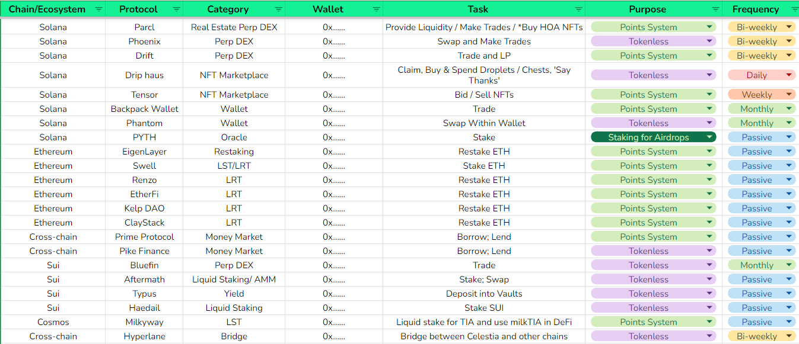

# Quản lý và theo dõi

Để tận dụng tối đa mùa airdrop, bạn cần theo dõi các dự án một cách có hệ thống và sử dụng các giao thức chưa ra token.

Dưới đây là một khung hướng dẫn để đơn giản hóa và theo dõi mọi thứ.

Điều đầu tiên để theo dõi việc "cày" airdrop của mình là chia nhỏ từng mục theo các khía cạnh sau:

Chuỗi/hệ sinh thái - Ethereum, Solana, Sui, Avalanche, cross-chain, v.v.

Farming thụ động so với chủ động - Các farm thụ động như cho vay jitoSOL trên MarginFi hoặc stake TIA: bạn chỉ cần nạp một lần là xong. Các farm chủ động như thực hiện tương tác trên chuỗi đòi hỏi hành động thường xuyên, liên tục.

Tần suất - Đối với các farm chủ động, đây là một nhiệm vụ tôi muốn thực hiện hàng ngày, hàng tuần, hai tuần một lần, hàng tháng, v.v.

Sử dụng các farm chủ động theo nhiều khoảng thời gian là rất quan trọng. Ví dụ, Arbitrum và Starknet tìm kiếm những người nhận airdrop đã thực hiện giao dịch trong nhiều tháng khác nhau. Một lịch trình farming airdrop tốt sẽ loại bỏ sự phỏng đoán, giúp bạn sử dụng một cách có hệ thống tất cả các giao thức mà bạn đang farming.

**Lưu ý đối với bảng theo dõi này là nên sử dụng kết hợp nó với Google Keep + Label của Google Keep để đạt hiệu quả cao hơn.**