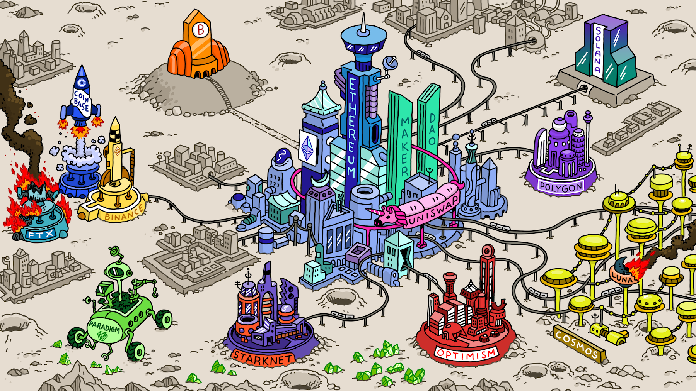

# Cầu nối (bridge)

### Cầu nối blockchain là gì?

Một cầu nối blockchain là một cổng kết nối giữa nhiều blockchain khác nhau, cho phép người dùng chuyển đổi tài sản và dữ liệu qua các blockchain khác nhau. Một cầu nối blockchain hỗ trợ quá trình chuyển đổi từ một tài sản gốc trên một blockchain này sang tài sản tương đương trên một blockchain khác. Nó có thể cung cấp thanh khoản từ một bể thanh khoản hoặc bằng cách sử dụng tài sản "wrapped" (đóng gói)

Chúng ta cần một cầu nối blockchain để khám phá các hệ sinh thái blockchain khác nhau mà không gặp rào cản và bị kẹt trong một hệ sinh thái duy nhất.

### Một số cầu nối thông dụng 

Sử dụng và lựa chọn một trong những cầu nối bên dưới, nên kiểm tra fee trước khi sử dụng cầu

   - [Bungee Exchange](https://www.bungee.exchange/)<base target="_blank">

   - [Across Protocol](https://across.to?ref=0x210d1C4c1e94c52edd53039190A3eA43C35e9506)<base target="_blank">

   - [Symbiosis Finance](https://symbiosis.finance/)<base target="_blank">

   - [Stargate Finance](https://stargate.finance/)<base target="_blank">

   - [Transporter.io](https://www.transporter.io/)<base target="_blank"> | by @chainlink CCIP

   - [Orbiter Finance](https://www.orbiter.finance/)<base target="_blank">

   - [Portal Bridge](https://www.portalbridge.com/#/transfer)<base target="_blank">

   - [Hop Exchange](https://hop.exchange/)<base target="_blank">

### Swap xuyên chuỗi

   - [https://xswap.link/](https://xswap.link/swap?ref=1sycrx)<base target="_blank"> | by @chainlink CCIP

### DEX Aggregator

DEX Aggregator là một công cụ cho sàn giao dịch phi tập trung hoạt động bằng công nghệ blockchain. Nó thu thập dữ liệu từ các DEX khác nhau và hợp nhất thông tin này trên nền tảng của nó. Nó hoạt động tương tự như một công cụ tìm kiếm, cho phép người dùng khám phá nhiều loại token và thực hiện giao dịch ở một nơi. Nó cho phép người dùng dễ dàng trao đổi và giao dịch các cặp token khác nhau ở một điểm, loại bỏ nhu cầu điều hướng trên nhiều sàn giao dịch DEX.

Ví dụ về nền tảng này bao gồm Defillama và CowSwap.

  - [Defillama](https://swap.defillama.com/)<base target="_blank">
  - [CowSwap](https://swap.cow.fi/)<base target="_blank">

   

