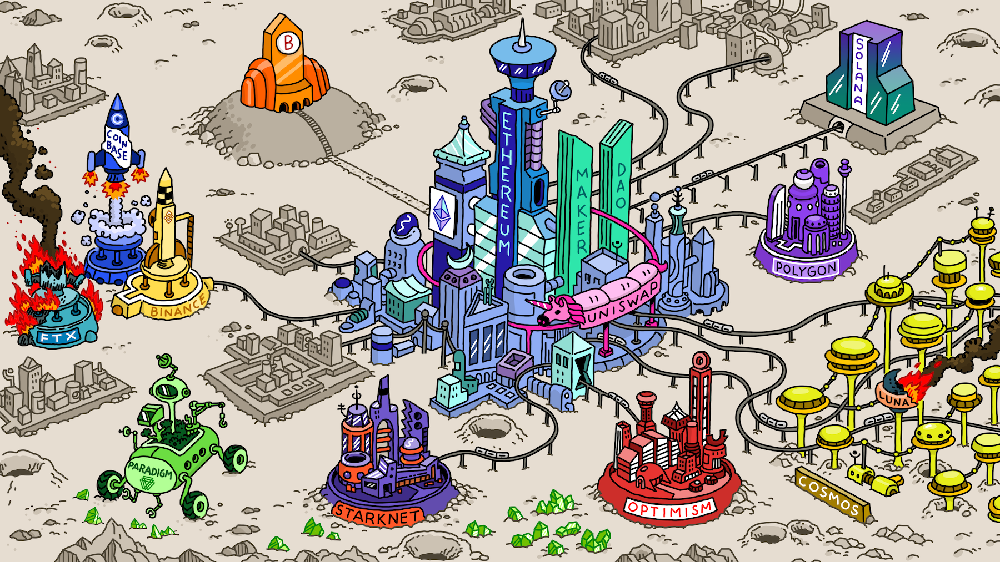

# Cầu nối (bridge)

### Cầu nối blockchain là gì?
Một cầu nối blockchain là một cổng kết nối giữa nhiều blockchain khác nhau, cho phép người dùng chuyển đổi tài sản và dữ liệu qua các blockchain khác nhau.

### Làm thế nào một cầu nối giữa các chuỗi làm việc?
Một cầu nối blockchain hỗ trợ quá trình chuyển đổi từ một tài sản gốc trên một blockchain này sang tài sản tương đương trên một blockchain khác. Nó có thể cung cấp thanh khoản từ một bể thanh khoản hoặc bằng cách sử dụng tài sản "wrapped" (đóng gói)

### Tại sao chúng ta cần một cầu nối blockchain?
Chúng ta cần một cầu nối blockchain để khám phá các hệ sinh thái blockchain khác nhau mà không gặp rào cản và bị kẹt trong một hệ sinh thái duy nhất.

### Một số cầu nối thông dụng 

Sử dụng và lựa chọn một trong những cầu nối bên dưới, kiểm tra fee trước khi sử dụng cầu

[1. Across Protocol](https://across.to?ref=0x210d1C4c1e94c52edd53039190A3eA43C35e9506)

[2. Stargate Finance](https://stargate.finance/)

[3. Orbiter Finance](https://www.orbiter.finance/)

[4. Portal Bridge](https://www.portalbridge.com/#/transfer)

[5. Hop Exchange](https://hop.exchange/)

Swap xuyên chuỗi 

- XSWAP sử dụng CCIP của Chainlink

[1. https://xswap.link/](xswap.link/swap?ref=1sycrx)

Tham khảo thêm: 

[datawallet](https://www.datawallet.com/crypto/best-crypto-bridges)