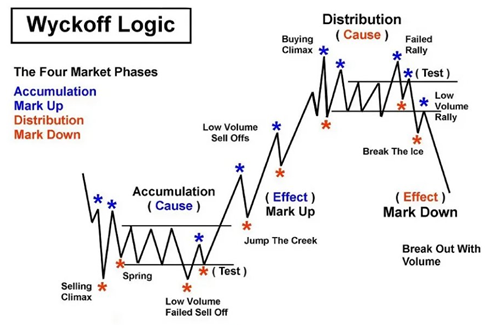
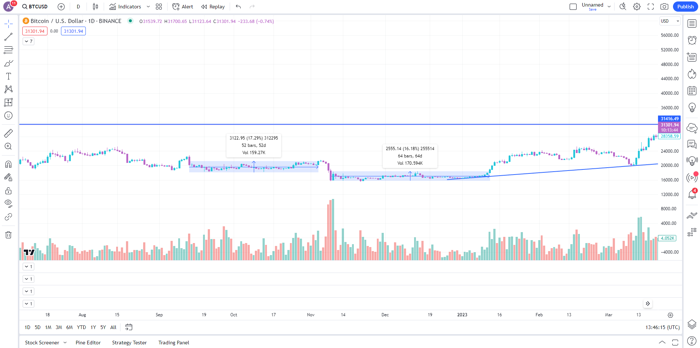

# Chu kì của thị trường

Trong thị trường tiền điện tử, nhiều người mất tiền vì họ không hiểu về chu kỳ thị trường. Hãy cùng xem xét cách hoạt động của các chu kỳ thị trường và cách bạn có thể định vị mình tốt nhất trong trường hợp thị trường đang trong giai đoạn tăng giá (bull market).

Giống như hầu hết các thị trường khác, thị trường tiền điện tử thường giao dịch theo một mô hình chu kỳ tăng và giảm do tâm lý con người. Khi thị trường tiền điện tử đang trong môi trường giảm giá (bearish), tính thanh khoản giảm và dòng tiền chảy vào Bitcoin (BTC). Mỗi người có quan điểm khác nhau về việc nhận biết các đáy tiềm năng. Dưới đây là một ví dụ.

Chú ý rằng chúng ta cũng có thể thấy hai giai đoạn trong kế hoạch tổng thể.
• "Jump the creek" (Vượt suối): Là lần kiểm tra lại sau khi giá tăng mạnh sau giai đoạn tích lũy ➩ để lừa các nhà bán sớm.
• "Break the ice" (Phá băng): Là lần kiểm tra lại sau khi giá giảm đáng kể sau giai đoạn phân phối ➩ để lừa các nhà mua muộn.
The translation in Vietnamese:

Trong quan điểm của tôi, sai lầm lớn mà nhiều người mắc phải là thiết lập một mức giá tuyệt đối cho giai đoạn tích lũy dựa trên Phân tích Kỹ thuật (TA) mà không xem xét ngữ cảnh của hành động giá.
Gần những đáy gần đây, BTC đã có hai giai đoạn tích lũy với khối lượng giao dịch, tâm trạng và sự quan tâm đều rất thấp.

Trong thị trường giảm giá (bear market), mọi người sẽ kêu gọi giá cả thấp hơn vì họ tin rằng giá chỉ có thể đi xuống. Nếu tất cả mọi người đều kêu gọi giá của BTC là 12.000 USD, khả năng là điều này sẽ không xảy ra. Thay vào đó, hãy tìm kiếm những giai đoạn tích lũy tiềm năng và áp dụng chiến lược DCA (Trung bình giá) xung quanh mức giá thấp thay vì xác định mức giá tuyệt đối.

Các tin tức không phải là người bạn đồng hành của bạn. Có lý do khiến hành động giá diễn ra trước khi tin tức được công bố. Đến khi bạn nghe về một tin tức nào đó, thị trường có thể đã định giá vào phần lớn sự chuyển động rồi. Bạn có thể cập nhật thông tin thường xuyên, nhưng hãy cảnh giác vì hầu hết chúng chỉ là tiếng ồn dẫn đến quyết định không hợp lý của bạn.
