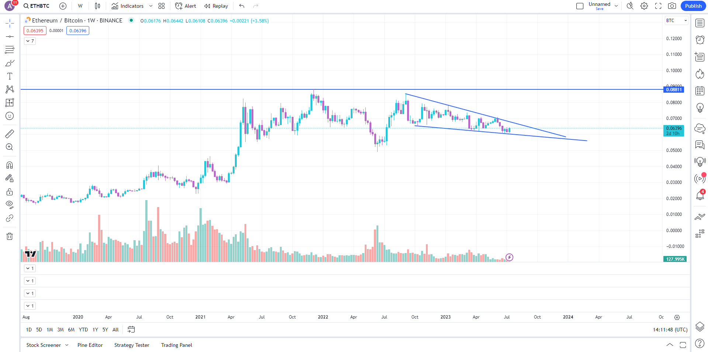
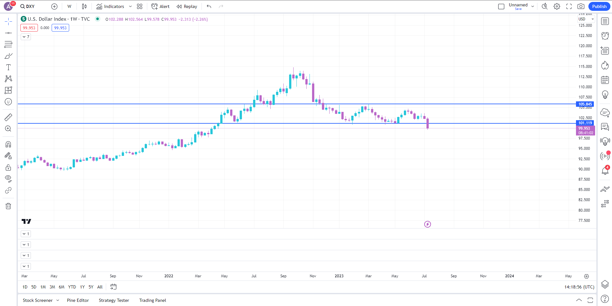
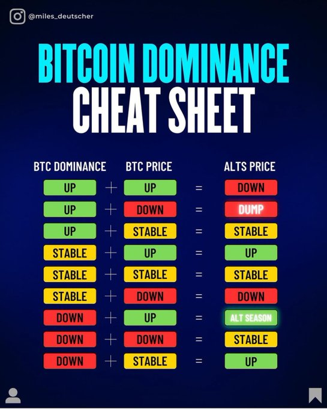

# Chu kì của Altcoin

Lý do chính khiến hầu hết mọi người trả lại lợi nhuận trong một thị trường tăng giá là vì họ để cho lòng tham chiếm lĩnh và không hiểu rõ khi nào một chu kỳ altcoin diễn ra. Tôi luôn nhớ về hình ảnh này khi nghĩ về vấn đề này.

Khi bạn đang tìm cách tích lũy altcoin, các biểu đồ quan trọng mà bạn nên xem xét bao gồm BTC Dominance và biểu đồ ETH/BTC. Trong biểu đồ BTC Dominance, chúng ta nhìn thấy BTC đang cố gắng kiểm tra lại mức kháng cự trước đó để xác nhận mức hỗ trợ. Hãy xem xét cẩn thận xem điều này có thành công không.

Tiếp đến dựa trên biểu đồ ETH/BTC, quan sát xem chiếc nêm giảm này có thể phá vỡ và thực hiện theo hướng tăng giá không. Hãy đảm bảo rằng danh mục của bạn được cấu trúc phù hợp dựa trên chu kỳ. Nếu BTC Dominance tăng, tôi không muốn chỉ nắm giữ altcoins.

Có những thời điểm bạn có thể muốn giao dịch altcoin với tỉ lệ nhiều hơn và có những thời điểm bạn muốn giữ một phần lớn hơn trong danh mục của mình là các đồng chính (như là BTC-ETH) hoặc đồng ổn định. Hãy đảm bảo luôn theo dõi biểu đồ và điều chỉnh vị thế một cách phù hợp.

Một biểu đồ nữa mà bạn nên lưu ý là biểu đồ DXY. Nói chung, việc DXY giảm là tích cực đối với tài sản rủi ro và ngược lại. Ở biểu đồ bên dưới, có thể thấy rằng DXY đã phá vỡ khỏi phạm vi của nó. Do đó bạn nên xem xét một sự từ chối rõ ràng tại mức kháng cự mới để xác nhận sự kết hợp của một đợt tăng giá mới.

Hãy nhìn bên cheat sheet bên dưới để suy ngẫm thêm và có những chiến lược đối với thị trường cho riêng mình. Và nên nhớ rằng tất cả những thông tin ở đây đều được đúc kết từ dữ liệu lịch sử, không có gì chắc chắn ở tương lai. Do đó bạn nên cẩn trọng với túi tiền của mình. Những thông tin ở đây không phải là lời khuyên tài chính dành cho bạn.

