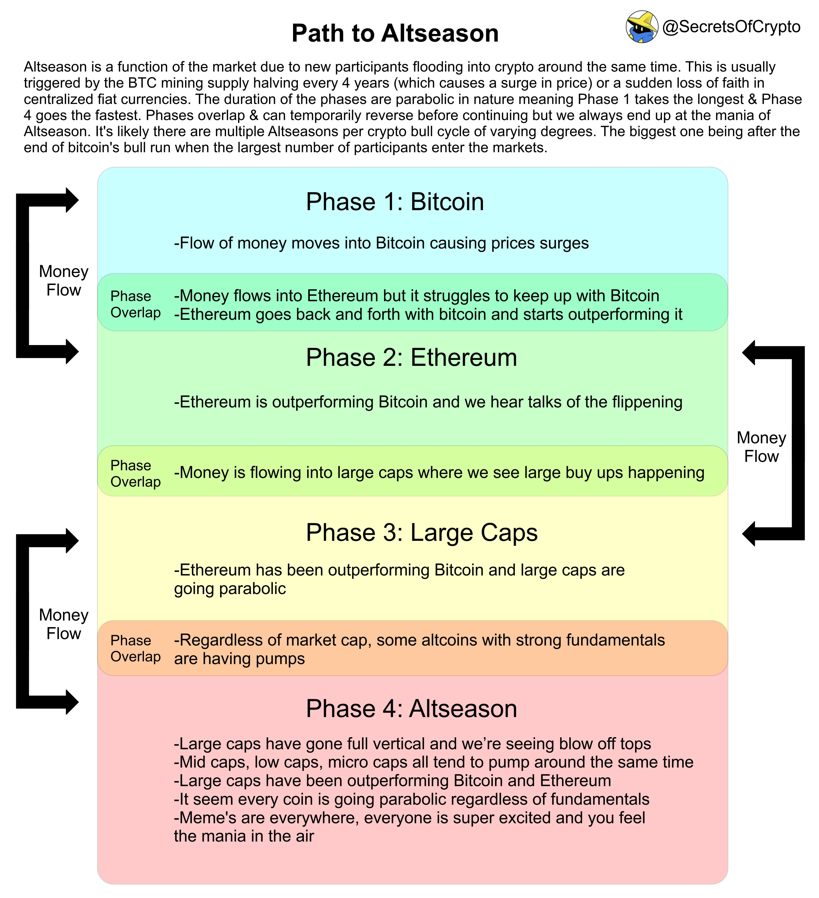
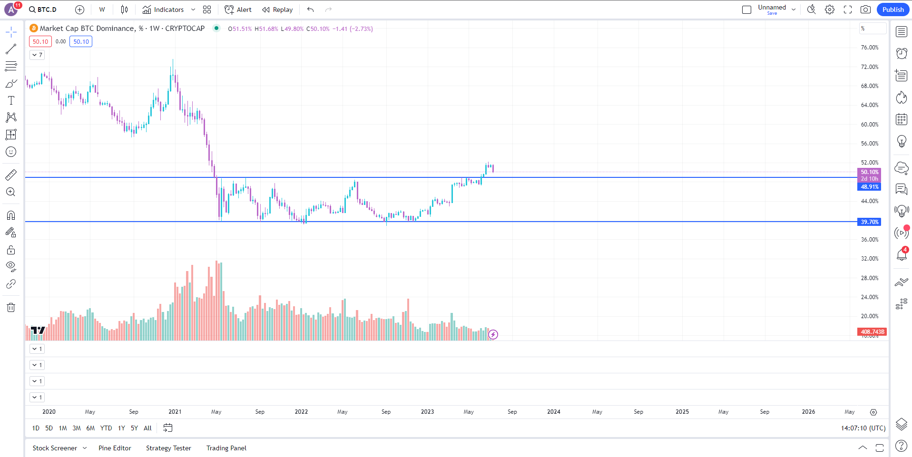

# Chu kì của Altcoin

Lý do chính khiến hầu hết mọi người trả lại lợi nhuận trong một thị trường tăng giá là vì họ để cho lòng tham chiếm lĩnh và không hiểu rõ khi nào một chu kỳ altcoin diễn ra. Tôi luôn nhớ về hình ảnh này khi nghĩ về vấn đề này.

Khi bạn đang tìm cách tích lũy altcoin, các biểu đồ quan trọng mà bạn nên xem xét bao gồm BTC Dominance và biểu đồ ETH/BTC. Trong biểu đồ BTC Dominance, chúng ta nhìn thấy BTC đang cố gắng kiểm tra lại mức kháng cự trước đó để xác nhận mức hỗ trợ. Hãy xem xét cẩn thận xem điều này có thành công không.

