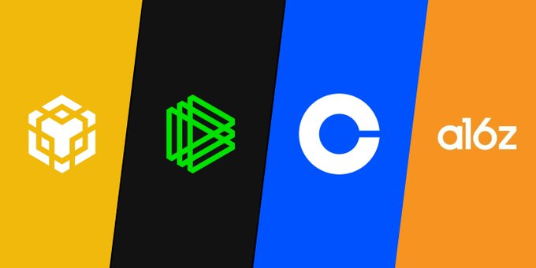

# Các quỹ đầu tư lớn

Vẫn theo nguyên tắc chạy theo dòng tiền để tìm những dự án hứa hẹn trong cryto, các quỹ đầu tư lớn trong lĩnh vực này là không thể bỏ qua để xem xét các danh mục đầu tư của họ. Từ đó có thể tìm ra cho mình những chiến lược hợp lý:

**Binance Labs:** https://www.crunchbase.com/organization/binance-labs-b05e

Binance Labs là một phần của Binance, một trong những sàn giao dịch tiền điện tử lớn nhất thế giới. Binance Labs là một phần tổ chức chuyên về công nghệ tiền điện tử và blockchain, với mục tiêu hỗ trợ và đầu tư vào các dự án khởi nghiệp có tiềm năng trong lĩnh vực này. Binance Labs cung cấp tài trợ và hỗ trợ chiến lược cho các dự án khởi nghiệp, trong đó có cả tư vấn về công nghệ, phát triển kinh doanh và quản lý tài chính.

Binance Labs thường đầu tư vào các dự án liên quan đến blockchain, tiền điện tử, dApps (ứng dụng phi tập trung), hạ tầng blockchain, và nhiều lĩnh vực khác có liên quan đến công nghệ tiền điện tử. Nó là một phần quan trọng trong việc thúc đẩy sự phát triển và ứng dụng rộng rãi của công nghệ blockchain và tiền điện tử trên toàn cầu.

**Paradigm:** https://www.crunchbase.com/organization/paradigm-b59b

Paradigm là một công ty quỹ đầu tư trong lĩnh vực tiền điện tử và blockchain có trụ sở tại San Francisco, California, Hoa Kỳ. Công ty này được thành lập bởi các nhà đầu tư và chuyên gia hàng đầu trong lĩnh vực tiền điện tử và blockchain, bao gồm Matt Huang và Fred Ehrsam. Matt Huang trước đây là một đối tác tại Sequoia Capital, một công ty quỹ đầu tư nổi tiếng, trong khi Fred Ehrsam là một trong người sáng lập sàn giao dịch tiền điện tử Coinbase.

Paradigm tập trung vào đầu tư vào các dự án, giao thức, và công ty liên quan đến blockchain và tiền điện tử. Công ty này có tiềm năng đóng vai trò quan trọng trong việc phát triển và hỗ trợ các dự án mới trong lĩnh vực này. Paradigm thường là một trong những nhà đầu tư hàng đầu trong các vòng gọi vốn (ICO và STO) và thường hỗ trợ các dự án mới về công nghệ blockchain và tiền điện tử thông qua việc cung cấp tài trợ và kiến thức chuyên sâu trong lĩnh vực này.

**Coinbase Ventures** https://www.crunchbase.com/organization/coinbase-ventures

Coinbase Ventures là một phần của Coinbase, một trong những sàn giao dịch tiền điện tử lớn và uy tín nhất trên thế giới. Coinbase Ventures là một ngành chuyên về đầu tư trong lĩnh vực tiền điện tử và blockchain. Mục tiêu chính của Coinbase Ventures là đầu tư vào các dự án khởi nghiệp và các công ty liên quan đến tiền điện tử và blockchain mà họ coi là có tiềm năng cao.

Coinbase Ventures cung cấp vốn và hỗ trợ tài chính cho các dự án tiền điện tử tiềm năng, giúp họ phát triển và mở rộng hoạt động. Ngoài tài trợ, Coinbase Ventures thường cũng cung cấp kiến thức, mạng lưới, và tư vấn chiến lược để giúp các dự án mình đầu tư phát triển thành công.

Điều này giúp Coinbase tạo ra một hệ sinh thái mạnh mẽ trong lĩnh vực tiền điện tử và blockchain, đồng thời hỗ trợ và đầu tư vào sự phát triển của cộng đồng tiền điện tử và công nghệ blockchain toàn cầu.

**A16Z crypto:** https://www.crunchbase.com/organization/a16z-crypto

A16Z Crypto là một phần của Andreessen Horowitz (A16Z), một công ty quỹ đầu tư công nghệ và khoa học máy tính nổi tiếng có trụ sở tại Silicon Valley, California, Hoa Kỳ. A16Z Crypto là một nhánh chuyên về đầu tư vào lĩnh vực tiền điện tử, blockchain và công nghệ liên quan.

Andreessen Horowitz đã thành lập A16Z Crypto để tập trung vào đầu tư vào các dự án và công ty tiền điện tử, dự án blockchain, và các dự án có tiềm năng trong lĩnh vực này. Họ đã tạo ra một quỹ đầu tư riêng cho tiền điện tử và blockchain với mục tiêu hỗ trợ và đầu tư vào các dự án thúc đẩy sự phát triển và ứng dụng rộng rãi của công nghệ blockchain.

A16Z Crypto không chỉ cung cấp tài trợ tài chính mà còn cung cấp kiến thức chuyên sâu về tiền điện tử và blockchain, và hỗ trợ chiến lược để giúp các dự án và công ty mà họ đầu tư phát triển thành công. A16Z Crypto đã trở thành một trong những cái tên quan trọng trong việc hỗ trợ và đầu tư vào cộng đồng tiền điện tử và blockchain.

Các quỹ đầu tư khác:

https://www.crunchbase.com/organization/multicoin-capital

https://www.crunchbase.com/organization/1confirmation

https://www.crunchbase.com/organization/pantera-capital

https://www.crunchbase.com/organization/dragonfly-capital

https://www.crunchbase.com/organization/polychain-capital

https://www.crunchbase.com/organization/crypto-currency-partners

https://www.crunchbase.com/organization/galaxy-digital

https://www.crunchbase.com/organization/winklevoss-capital

https://www.crunchbase.com/organization/animoca-brands-corporation

https://www.crunchbase.com/organization/meta4-capital
